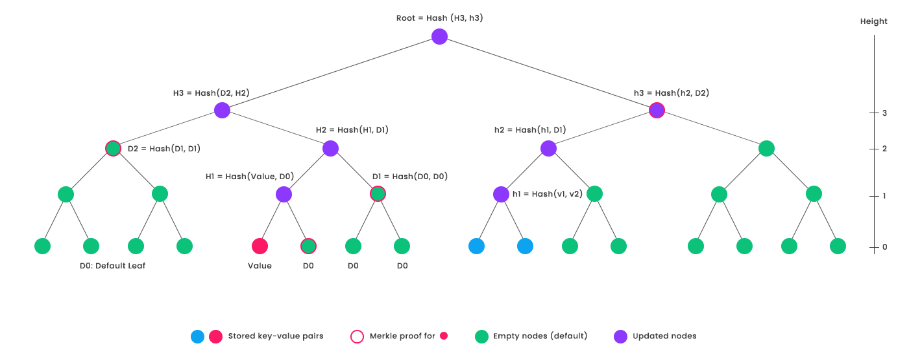
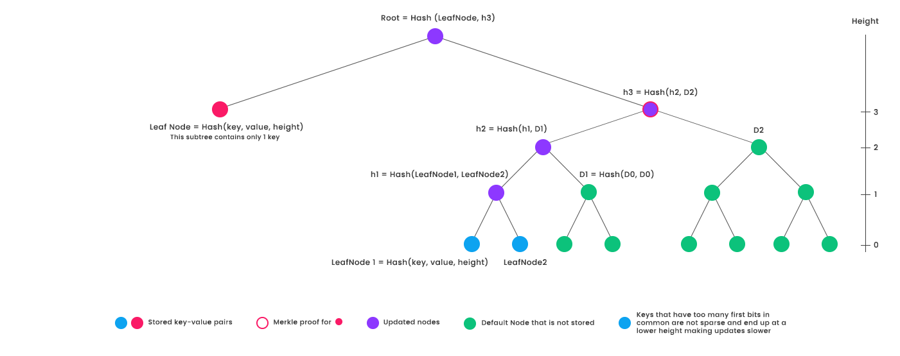
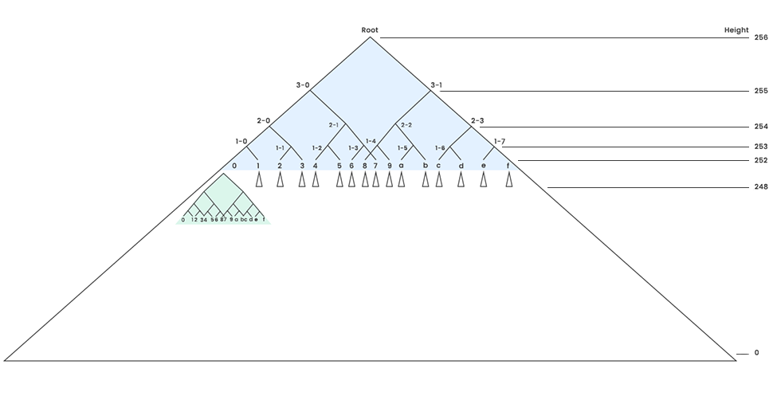

# AERGO StateTrie

## Features

* Efficient Merkle proof verification (binary tree structure)
* Efficient database reads and storage through node batching
* Reduced data storage (leaf nodes for subtrees contain 1 key)
* Reduced hash computation (leaf nodes for subtrees contain 1 key)
* Simultaneous update of multiple keys with goroutines

Aergo Trie is a modified version of a Sparse Merkle Tree which stores values at the highest subtree containing only one key.
The benefit achieved from this is that, on average, in a tree containing N random keys, just log(N) hashes are required to update a key in the tree. Therefore the trie height is on average log(N), making inclusion and non-inclusion proofs shorter.


## Standard Sparse Merkle Tree



*Figure 1. An example sparse Merkle tree of height=4 (4-bit keys) containing 3 keys. The 3 keys are shown in red and blue. Default nodes are shown in green. Non-default nodes are shown in purple.*

Medium article about the Standard SMT : [https://medium.com/@ouvrard.pierre.alain/sparse-merkle-tree-86e6e2fc26da](https://medium.com/@ouvrard.pierre.alain/sparse-merkle-tree-86e6e2fc26da)

Implementation of the standard SMT : [https://github.com/aergoio/SMT](https://github.com/aergoio/SMT)

## Aergo Trie
### Modification of the Sparse Merkle Tree
To reduce the number of hashing operations necessary to update a key in a tree, we created leaf nodes. A leaf node is stored at the highest subtree that contains only 1 non-default key. So, the hashing of the tree starts from the height of leaf nodes instead of height 0. If the tree contains N random keys, then on average, leaf nodes will be created around height = log(N).

Another benefit of the Aergo Trie is that Default Hashes are no longer necessary. We add the following property to the hash function : H(0,0) = 0. Looking at the example below, **D1 = Hash(D0,D0) = Hash(byte(0),byte(0)) = byte(0) = D2 =...= D256**.


*Figure 2. H3 was the highest subtree containing only one key: the red one. So, Value will take its place in the modified sparse Merkle tree.*

### Merkle Proofs
Using a binary tree gives us very simple and easy-to-use Merkle proofs.
On the diagram above, the Merkle proof of the red key is composed of the node with a red circle: [h3]
In case of the standard SMT that proof would have been [D0, D1, D2, h3]

### Compressed Merkle proofs
Like in the standard sparse Merkle tree, Merkle proofs can also be compressed. We can use a bitmap and set a bit for every index that is not default in the proof. The proof that the blue LeafNode1 is included in the tree is: [LeafNode2, D1, D2, LeafNode]. This proof can be compressed to 1001[LeafNode2, LeafNode]. The verifier of the compressed Merkle proof should know to use D1 to compute h2 because the second index of the bitmap is 0, and D2 for the third proof element, etc.

### Proofs of non-inclusion
There are 2 ways to prove that a key is not included in the tree :
- prove that the Leaf node of another key is included in the tree and is on the path of the non-included key.
- prove that a default node (byte(0)) is included in the tree and is on the path of the non-included key.

For example, a proof that key=0000 is not included in the tree is a proof that LeafNode is on the path of key and is included in the tree. A proof that key=1111 is not included in the tree is a proof that D2 is on the path of the key and is included in the tree.

### Deleting from the tree
When a leaf is removed from the tree, special care is taken by the Update() function to keep leaf nodes at the highest subtree containing only 1 key. Otherwise, if a node has a different position in the tree, the resulting trie root would be different even though keys and values are the same.

So, when a key is deleted, Update() checks if it’s sibling is also a leaf node and moves it up until the highest subtree root containing only that non-default key.


*Figure 3. The same tree after deleting a blue key : LeafNode1 moves up to the highest subtree containing one key*

### Node batching
When storing each node as a root with 2 children, the quantity of nodes to store grows very quickly and a bottleneck happens due to multiple threads loading nodes from memory. A hex Merkle tree would solve this problem as each key has 16 children and a smaller height of 64 (256/4), though as we said earlier, we need the tree to be binary. We can achieve the same features of a hex tree by using node batching.

Instead of storing 2 children for one node, we store the subtree of height 4 for that node. A tree of height 4 has 16 leaves at height 0 (like hex). So, the value of a node is an array containing all the nodes of the 4-bit tree. The children of a node at index i in the tree can be found at index 2*i+1 and 2*i+2.

A node is encoded as follows:

```
{ Root : [ [ byte(0/1) to flag a leaf node ], 3–0, 3–1, 2–0, 2–1, 2–2, 2–3, 1–0, 1–1, 1–2, 1–3, 1–4, 1–5, 1–6, 1–7, 0, 1, 2, 3, 4, 5, 6, 7, 8, 9, a, b, c, d, e, f ] }
```

For example, to get the children of node 3–0 at index id=1 in the array, we can access the left child 2–0 at index (2 * id + 1) = index 3 and the right child 2–1 at index (2 * id + 2) = index 4.

To each node, we append a byte flag to recognize the leaf nodes. Since the nature of Root is not know ahead of time, the byte flag is stored at the first index of the nodes array.


*Figure 4. A visual representation of node batching. The first batch is blue, and all 16 leaves of a batch are roots to other batches (green). A batch contains 30 nodes.*

The example from figure 2 will be encoded as follows :
```
{Root : [ [byte(0)], LeafNodeHash, h3, LeafNodeKey, LeafNodeValue, h2, D2=nil, nil, nil, nil, nil, h1, D1=nil, nil, nil, nil, nil, nil, nil, nil, nil, nil, nil, LeafNode1Hash, LeafNode2Hash, nil, nil, nil, nil, nil, nil ]}
```
Where LeafNodeHash = Hash(key, value, height)

To store the batch in the database, it is serialized with a bitmap which allows us to store only the non default nodes.
The bitmap is 4 bytes = 32 bits. The first 30 bits are for the batch nodes, the 31st bit is the flag to make a shortcut batch (a batch that only contains a key and a value at 3-0 and 3-1), the 32nd bit is not used.

The figure 2 example after serialization:
```
11111000001000000000001100000010 [LeafNodeHash][h3][LeafNodeKey][LeafNodeValue][h2][h1][LeafNode1Hash][LeafNode2Hash]
```

Node batching has two benefits : reduced number of database reads and concurrent update of the height 4 subtree without the need for a lock.

## Usage

- NewTrie

```go
func NewTrie(root []byte, hash func(data …[]byte) []byte, store db.DB) *Trie {
```

When creating an empty tree, set root to nil. A nil root means that it is equal to the default value of its height. Use a custom hash function or use the Hasher in utils and specify a database if you plan to commit nodes.


- Update

```go
func (s *Trie) Update(keys, values [][]byte) ([]byte, error) {
```

‘keys [][]byte’ is a sorted array of keys, ‘values [][]byte’ contains the matching values of keys.

Update will recursively go down the tree and split the keys and values according to the side of the tree they belong to: multiple parts of the tree can be simultaneously updated.

If update is called several times before Commit, only the last state is committed.

- AtomicUpdate

```go
func (s *Trie) AtomicUpdate(keys, values [][]byte) ([]byte, error) {
```

AtomicUpdate updates the tree with sorted keys and values just like Update. But unlike update, if AtomicUpdate is called several times before Commit, all the intermediate states from AtomicUpdate calls will be recorded. This can be useful when authenticating the state of each block, but not committing to the database right away.

- Get

```go
func (s *Trie) Get(key []byte) ([]byte, error) {
```

Get the value of a key stored in the tree, if a key is default, i.e., not stored, return nil.

- Commit

```go
func (s *Trie) Commit() error {
```

Commit the updated nodes to the database. When update is called, the new nodes are stored in smt.db.updatedNodes. Commit then stores to disk.

- StageUpdates

```go
func (s *Trie) StageUpdates(txn *db.Transaction) {
```
StageUpdates loads the updated nodes into the given database transaction. It enables the commit of the trie with an external database transaction.

- Stash

```go
func (s *Trie) Stash(rollbackCache bool) error {
```

Use the Stash function to revert the update without committing.

- Revert

```go
func (s *SMT) Revert(toOldRoot []byte) error {
```

When revert is called, the trees to rollback (between the current tree and toOldRoot) are deleted from the database.

- MerkleProof

```go
func (s *Trie) MerkleProof(key []byte) ([][]byte, bool, []byte, []byte, error) {
```

MerkleProof creates a Merkle proof of inclusion/non-inclusion of the key. The Merkle proof is an array of hashes.

If the key is not included, MerkleProof will return false along with the proof leaf on the path of the key.

- MerkleProofPast

```go
func (s *Trie) MerkleProofPast(key []byte, root []byte) ([][]byte, bool, []byte, []byte, error) {
```

MerkleProofPast creates a Merkle proof of inclusion/non-inclusion of the key at a given trie root. This is used to query state at a different block than the last one.

- MerkleProofCompressed

```go
func (s *Trie) MerkleProofCompressed(key []byte) ([]byte, [][]byte, uint64, bool, []byte, []byte, error) {
```

MerkleProofCompressed creates the same Merkle proof as MerkleProof but compressed using a bitmap

- VerifyInclusion

```go
func (s *Trie) VerifyInclusion(ap [][]byte, key, value []byte) bool {
```

Verifies that the key-value pair is included in the tree at the current Root.

- VerifyNonInclusion

```go
func (s *Trie) VerifyNonInclusion(ap [][]byte, key, value, proofKey []byte) bool {
```

Verify a proof of non-inclusion. Verifies that a leaf(proofKey, proofValue, height) of empty subtree is on the path of the non-included key.

- VerifyInclusionC

```go
func (s *Trie) VerifyInclusionC(bitmap, key, value []byte, ap [][]byte, length int) bool {
```

Verifies a compressed proof of inclusion. ‘length’ is the height of the leaf key-value being verified.

- VerifyNonInclusionC

```go
func (s *Trie) VerifyNonInclusionC(ap [][]byte, length int, bitmap, key, value, proofKey []byte) bool {
```

Verify a compressed proof of non-inclusion. Verifies that a leaf (proofKey, proofValue, height) of empty subtree is on the path of the non-included key.


For more information about the Aergo StateTrie : [https://medium.com/aergo/releasing-statetrie-a-hash-tree-built-for-high-performance-interoperability-6ce0406b12ae](https://medium.com/aergo/releasing-statetrie-a-hash-tree-built-for-high-performance-interoperability-6ce0406b12ae)
